# DataTrust AI v3 — Comprehensive Forensics & Scientific Integrity Audit

**Audit Date**: 2026-09-11  
**Project Path**: `C:\Users\Lenovo\.gemini\antigravity\scratch\datatrust-ai`  
**Current Baseline**: Phase 1 Implementation Baseline (50 passed tests)  
**Target Objective**: Final Research-Grade Stabilization (Paper, Thesis, Patent, Benchmarks, Engine, API, UI)

---

## 1. Executive Summary of Forensic Findings

A forensic audit of all 18 Python modules in `datatrust/`, the FastAPI backend in `backend/`, the 10 test suites in `tests/`, benchmark scripts in `benchmarks/`, and research artifacts in `docs/` reveals that while the core scientific pipeline of DataTrust AI v3 is operational and tested (50/50 passing tests), several critical architectural inconsistencies, legacy v2 artifacts, and notation divergences exist:

1. **Legacy v2 Terminology & Dimension Mismatches**:
   - The paper (`docs/paper/research_paper.md`), thesis (`docs/thesis/msc_thesis.md`), and patent draft (`docs/patent/patent_draft.md`) are currently frozen in **DataTrust AI v2** terminology, claiming **7 dimensions** (Completeness, Outlier Resilience, Drift Stability, Label Integrity, Temporal Validity, Cardinality Schema, Correlation Integrity) instead of the canonical **8 v3 dimensions** (CMP, VAL, CNS, UNQ, TIM, OUT, BAL, COV).
   - In `backend/routes/evaluate.py`, the `/calibrate` route still takes legacy dimension parameters (`missingness_score`, `drift_stability_score`, `leakage_score`, etc.).
   - In `datatrust/optimizer.py`, heuristics query legacy aliases (`QualityDimension.LEAKAGE`, `QualityDimension.TEMPORAL_VALIDITY`).
2. **Remediation Action-Authoritativeness Defect**:
   - In `DataRemediator.apply_remediations` and `DataRemediator.fit_and_transform_splits`, the `action_ids` parameter is accepted but **unconditionally ignored**: all 6 hardcoded transformation stages execute if column heuristics match, rather than executing *only* the requested/selected action IDs.
3. **Cryptographic Index Hashing Vulnerability**:
   - Index verification currently uses `hashlib.sha256(str(list(index)).encode('utf-8'))`. Stringifying a list of numpy integer types (`np.int64(95)`) versus standard python integers (`95`) produces different string representations, creating risk of false immutability assertion failures. A canonical integer-cast serializer is required.
4. **MRU Optimizer vs Canonical Engine Disconnect**:
   - `RemediationOptimizer.simulate_remediations` performs naive additive arithmetic (`projected += act.fitness_improvement`) rather than invoking the canonical fitness and defect policy.
   - For Dataset C, the simulated gain was hardcoded as `max(30.0, 99.0 - current_trust_score) = +99.0`, which directly produced the phantom $99.0$ prediction when actual fitness remained $0.0$ under test immutability.
5. **Closed-Loop Decision State Machine Gap**:
   - The system computes empirical performance change, but lacks an authoritative closed-loop outcome enum (`ACCEPTED`, `REJECTED`, `NO_IMPROVEMENT`, `REGRESSED`, `BLOCKED`, `REVIEW_REQUIRED`).
6. **Dataset C Root Cause**:
   - In `DataRemediator.fit_and_transform_splits`, timestamp deduplication is applied to the training set (removing training duplicates), but test immutability preserves test duplicate timestamps. When train and test splits are concatenated for post-evaluation, duplicates remain in the test slice, and ordering across the split boundary is broken. The post-evaluation profiler detects duplicate timestamps and re-triggers the RED Hard Veto. In `engine.py`, lines 513-514 previously hardcoded `duplicate_timestamps = 0` in `remediated_stats`, masking the remaining test-partition duplicates.

---

## 2. Repository Dependency Map

```mermaid
graph TD
    UI["Frontend Dashboard (backend/static/index.html)"] --> API["FastAPI Router (backend/routes/evaluate.py)"]
    API --> Engine["DataTrustEngine Facade (datatrust/engine.py)"]
    
    Engine --> Profiler["DataProfiler (datatrust/profiler.py)"]
    Engine --> TaskInfer["TaskInferenceEngine (datatrust/task_infer.py)"]
    Engine --> Quality["QualityEngine (datatrust/quality_engine.py)"]
    Engine --> SensMatrix["TaskQualitySensitivityMatrix (datatrust/sensitivity.py)"]
    Engine --> AHP["AHPWeightingEngine (datatrust/weighting.py)"]
    Engine --> Veto["IntelligentVetoEngine (datatrust/veto_engine.py)"]
    Engine --> Validator["DownstreamValidator (datatrust/validator.py)"]
    Engine --> Calibration["PerformanceCalibrationEngine (datatrust/calibration.py)"]
    Engine --> Optimizer["RemediationOptimizer (datatrust/optimizer.py)"]
    Engine --> Remediator["DataRemediator (datatrust/remediator.py)"]
    Engine --> Uncertainty["FitnessUncertaintyEstimator (datatrust/uncertainty.py)"]
    Engine --> Repro["ReproducibilityEngine (datatrust/reproducibility.py)"]
    Engine --> Models["Data Models & Schemas (datatrust/models.py)"]
    Engine --> Config["Prior Configuration (datatrust/config.py)"]
```

### 2.1 Subsystem Inventory & Responsibilities

| Subsystem | File Path | Primary Classes / Functions | Upstream Inputs | Downstream Outputs |
| :--- | :--- | :--- | :--- | :--- |
| **Ingestion / Profiling** | `datatrust/profiler.py` | `DataProfiler.profile()` | `pd.DataFrame`, column hints | `ProfilingMetadata`, stats dict |
| **Task Inference** | `datatrust/task_infer.py` | `TaskInferenceEngine.infer_task()` | `pd.DataFrame`, metadata | `TaskInferenceResult`, $P(T\|D)$, evidence |
| **Quality Engine** | `datatrust/quality_engine.py` | `QualityEngine.run_all_dimensions()` | `pd.DataFrame`, task, target/time | 8 `DimensionResult` objects |
| **Sensitivity Matrix** | `datatrust/sensitivity.py` | `TaskQualitySensitivityMatrix` | Profiling, task, quality results | Sensitivity row, weights, CR |
| **AHP Weighting** | `datatrust/weighting.py` | `AHPWeightingEngine.compute_weights()` | Reciprocal $8 \times 8$ matrix | Principal eigenvector weights, $\lambda_{\max}$, CR |
| **Defect Policy** | `datatrust/veto_engine.py` | `IntelligentVetoEngine.evaluate_defect_policy()` | Raw fitness, dimensions, task | `DefectPolicyResult`, status, caps |
| **Downstream Validation** | `datatrust/validator.py` | `DownstreamValidator` | Splits, task, models | Empirical test metrics (RMSE, $F_1$) |
| **Performance Calibration** | `datatrust/calibration.py` | `PerformanceCalibrationEngine` | Observed loss, residual, prior weights | $W_{\text{calibrated}}$, $L(w_{\text{cal}})$, status |
| **MRU Optimizer** | `datatrust/optimizer.py` | `RemediationOptimizer` | Quality results, fitness, costs | Ranked `RemediationActionV2`, What-If scenarios |
| **Data Remediator** | `datatrust/remediator.py` | `DataRemediator` | Train/test splits, action IDs | Transformed splits, fit params, log |
| **Uncertainty Estimator** | `datatrust/uncertainty.py` | `FitnessUncertaintyEstimator` | Sample size, task confidence, residuals | $\sigma^2_{\text{comp}}$, $SE_{\text{comp}}$, $95\%$ CI |
| **Reproducibility** | `datatrust/reproducibility.py` | `ReproducibilityEngine` | Report, splits, hash | SHA-256 receipts, audit receipts |

---

## 3. Test Suite Inventory

Total: 50 tests across 10 modules:

| Test Module | Test Count | Scope & Covered Functionality |
| :--- | :---: | :--- |
| `tests/test_phase1.py` | 14 | Profiler SHA-256, Task inference bounds, User override, Consistency structural logic, Outlier isolation forest, Coverage unavailable, 8 canonical dimensions, Sensitivity matrix, AHP eigenvector ($RI=1.41, CR<0.10$), Three-level defect policy (Green, Yellow, Red), End-to-end Phase 1 pipeline. |
| `tests/test_api.py` | 9 | FastAPI health endpoint, tasks endpoint, demo presets, CSV upload, auto-detect endpoint, remediate-and-validate, sensitivity matrix, receipt generation, scenario presets. |
| `tests/test_validator.py` | 5 | Downstream regression validation, classification validation, what-if generation, test-set integrity & audit receipt, time-series test immutability. |
| `tests/test_weighting.py` | 4 | AHP weights sum to 1.0, consistency ratio check, task-specific weight divergence, non-compensatory veto rule. |
| `tests/test_quality.py` | 4 | Completeness evaluation, temporal monotonicity check, outlier detection, configurable imbalance policy. |
| `tests/test_calibration.py` | 3 | Performance prediction monotonicity, closed-loop error reduction, calibration rejection policy. |
| `tests/test_research_layers.py`| 3 | Multi-source uncertainty estimator, reproducibility engine receipts, native RMSE calibration. |
| `tests/test_task_infer.py` | 6 | Time series inference, classification inference, regression inference, descriptive inference, distribution properties, manual override. |
| `tests/test_optimizer.py` | 2 | MRU ranking, simulate remediations. |
| `tests/test_engine.py` | 1 | Full end-to-end evaluation pipeline and PDF report generation. |

---

## 4. Research Artifact Inventory

| Research Document | Location | Current State & Deficiencies | Required Stabilization Action |
| :--- | :--- | :--- | :--- |
| **Research Paper** | `docs/paper/research_paper.md` | Frozen in v2: describes 7 dimensions, mentions 5-model ablation, lacks 14-stage pipeline and empirical test-set immutability analysis. | Rewrite to reflect final v3 implementation with 8 canonical dimensions, 7-experiment ablation, verified theorems, and honest limitations. |
| **MSc Thesis** | `docs/thesis/msc_thesis.md` | Describes v2 with 7 dimensions; claims guaranteed error reduction without qualification. | Update to v3 canonical dimensions, qualify calibration and MRU guarantees, document Dataset C empirical findings. |
| **Patent Draft** | `docs/patent/patent_draft.md` | Contains v2 7-dimension claims; needs concrete alignment with implemented technical embodiments under CRI guidelines. | Refine independent and dependent claims to reflect the 8 canonical dimensions, non-compensatory circuit breaker, and closed-loop validation. |
| **Project State** | `PROJECT_STATE.md` | Up to date with Phase 1 baseline. | Update with final research-grade stabilization status, test count, and benchmark outputs. |
| **Pipeline Trace** | `docs/pipeline.md` | Documents 14 stages of DataTrust AI v3. | Verify alignment with action-authoritative remediation and canonical index hashing. |
| **Architecture** | `docs/architecture.md` | Documents mathematical formulations and Mermaid dataflow. | Ensure synchronization with 8 dimensions and canonical index hashing. |
| **Research Log** | `docs/research_log.md` | Complete log of system evolution. | Append Phase 0–23 stabilization milestone entries. |
| **Benchmark Results**| `docs/benchmark_results.md`| Complete ablation and 4-scenario benchmark outputs. | Update with post-stabilization benchmark rerun numbers. |

---

## 5. Specific Claims Requiring Scientific Qualification

1. **Claim of Universal Model Improvement via Remediation**:
   - *Issue*: Remediating training data (e.g. imputing or clipping) does NOT guarantee that arbitrary downstream machine learning models will improve. For example, if a model relies on specific tail behavior, clipping outliers can slightly increase test loss.
   - *Required Qualification*: State clearly that remediation improves *data fitness* and *heuristic model surrogate loss*, but empirical downstream model performance depends on model inductive bias and is subject to empirical accept/reject verification.
2. **Claim of Guaranteed Calibration Convergence**:
   - *Issue*: Gradient updates on non-convex or noisy downstream validation surfaces can stall or oscillate if learning rates are unconstrained.
   - *Required Qualification*: State that adaptive calibration includes an explicit rejection policy (`is_improved = False`) when loss does not decrease by at least $\epsilon_{\text{tol}}$.
3. **Claim of Learned $M(T,Q)$ Matrix**:
   - *Issue*: $M(T,Q)$ is constructed from domain-theoretic literature and expert priors, not learned via end-to-end gradient descent or meta-learning over 1,000 datasets.
   - *Required Qualification*: Explicitly label $M(T,Q)$ as `LITERATURE / EXPERT PRIOR (PRE-EXPERIMENTAL UNCALIBRATED)`.
4. **Claim of Definitive Clustering Task Inference**:
   - *Issue*: Unlabeled tabular datasets can be used for clustering, descriptive statistics, density estimation, or anomaly detection.
   - *Required Qualification*: Bounded confidence $\le 0.60$ with exposed heuristic evidence signals and mandatory manual override capability.
5. **Claim of Population Representativeness**:
   - *Issue*: Representativeness cannot be measured from sample data alone without a known external population census or sampling frame.
   - *Required Qualification*: Report population representativeness strictly as `UNAVAILABLE` and measure only observable feature-space support density.

---

## 6. Proposed Stabilization Action Plan

1. **Phase 1: Canonical Data Model**:
   - Enforce 8 canonical dimensions (CMP, VAL, CNS, UNQ, TIM, OUT, BAL, COV) across all modules, tests, backend routes, and documentation.
   - Treat old names exclusively as explicit backward-compatible aliases.
2. **Phase 7: Action-Authoritative Remediation Registry**:
   - Build a formal `ActionRegistry` in `datatrust/remediator.py`.
   - Ensure `apply_remediations` and `fit_and_transform_splits` execute *only* the specific requested `action_ids`.
   - Record requested, executed, and skipped actions.
3. **Phase 9: Canonical Cryptographic Index Serialization**:
   - Implement `canonicalize_index(index)` and `hash_index(index)` casting indices to canonical standard integers before deterministic SHA-256 hashing.
   - Use this utility in `remediator.py`, `validator.py`, and `reproducibility.py`.
4. **Phase 10: Canonical MRU Simulator**:
   - Unify `RemediationOptimizer` with canonical fitness and defect policy evaluation.
   - Separate predicted/simulated gains from observed empirical outcomes.
5. **Phase 11: Closed-Loop Decision Engine**:
   - Define formal remediation decisions: `ACCEPTED`, `REJECTED`, `NO_IMPROVEMENT`, `REGRESSED`, `BLOCKED`, `REVIEW_REQUIRED`.
6. **Phase 13: Dataset C Root Cause Resolution**:
   - Clarify difference between "duplicate timestamp collisions" (unique duplicate timestamp values) and "rows removed due to timestamp duplication" (total excess rows).
   - Document and test the test-set immutability behavior on Dataset C.
7. **Phases 15–18: Research Document Synchronization**:
   - Completely update `docs/paper/research_paper.md`, `docs/thesis/msc_thesis.md`, and `docs/patent/patent_draft.md` to reflect DataTrust AI v3, 8 canonical dimensions, and the stabilized closed loop.
8. **Phases 20–22: Verification & Benchmarks**:
   - Run complete test suite and benchmarks, update `PROJECT_STATE.md`, and generate `docs/final_verification.md`.

---

## 7. Defect Policy Semantics & Ablation Study Consistency Resolution

1. **Defect Policy Multi-Tier Semantics**:
   - **RED Hard Veto ($F_{\text{final}} = 0.0$, `status = "UNSAFE"`, `is_unsafe = True`)**: Enforces absolute non-compensatory rejection upon fatal structural defects (Dataset C temporal scramble & collisions; Dataset D severe class collapse < 2%).
   - **YELLOW Warning Cap ($F_{\text{final}} \le C_{\text{cap}} \in [60.0, 70.0]$, `status = "WARNING"`, `is_unsafe = False`)**: Enforces score ceiling on moderate non-fatal defects without pipeline termination.
   - **GREEN Normal ($F_{\text{final}} = F_{\text{raw}}$, `status = "NORMAL"`, `is_unsafe = False`)**: Unconstrained linear fitness when no fatal or warning defects occur.

2. **Dataset C Interpretation**:
   - Scrambled timestamps and duplicate collisions trigger RED Hard Veto ($F=0.0$) in Exp 3. Preserving holdout test immutability correctly yields partition-aware `REVIEW_REQUIRED`.

3. **Dataset D Interpretation (Decoupling Structural Risk from Downstream Accuracy)**:
   - Evaluates to RED Hard Veto ($F=0.0$, `status = "UNSAFE"`) in Exp 3 despite baseline downstream Macro $F_1 = 0.98$.
   - The safety policy evaluates structural data risk independently of single-metric downstream model performance. This is **not a model failure**, but an essential data safety circuit breaker against severe class collapse (< 1.5% minority).

